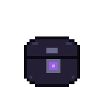

# Chestnut

<p align="center">
  <a href="https://gapmiss.github.io/chestnut"></a>
</p>

A native macOS desktop companion for multi-vault Obsidian users.
[gapmiss.github.io/chestnut](https://gapmiss.github.io/chestnut)

Chestnut is an always-on-top pixel-art treasure-chest creature that reacts to
your writing activity and acts as a control surface across all your vaults. It
watches the filesystem directly, no Obsidian plugin required, no settings
modified.

## Features

- **Vault Hopper** lists all your registered vaults. ⏎ opens, ⌘⏎ goes to
  today's daily note, ⌥⏎ reveals in Finder.
- **Pin a vault** so it always sorts first in every list and starts
  pre-selected for captures and deliveries. Toggle with the pin icon or ⌘P.
- **Note Courier** lets you drag files onto the pet and pick a destination
  vault. Notes land at the vault root with their embedded attachments
  (`![[…]]`, ``) resolved and carried along, references rewritten to
  match the destination layout. Other file types go to the attachment folder.
  Conflict-safe naming, journaled for undo.
- **Quick Capture** is a floating panel for jotting markdown into any vault.
  Formatting toolbar, ⌘B/⌘I/⌘K shortcuts, ⌘1-⌘9 to pick the vault. Drafts
  survive dismiss/reopen.
- **Plugins** let you extend drag-and-drop and a paste hotkey with shell
  scripts. Drop a URL, image, or file onto Chestnut and a plugin transforms
  it into a vault note. See [PLUGINS.md](PLUGINS.md) for the full guide and
  [`Examples/plugins/`](Examples/plugins/) for ready-made examples (OCR,
  PDF extraction, bookmarks, code snippets, and more). View installed plugins
  in the right-click menu.
- After a capture or delivery, a speech bubble tells you where your text
  went. Click it to open the note in Obsidian (uses the `obsidian` CLI when
  available, falls back to opening the vault).
- Idle, peek, writing, chomp, carry, deliver, sleep animations. Hand-coded
  pixel-art frames with swappable color themes.

## Install

### Homebrew

```bash
brew install --cask --no-quarantine gapmiss/tap/chestnut
```

### Manual

Download [`Chestnut.dmg`](https://github.com/gapmiss/chestnut/releases/latest/download/Chestnut.dmg) from the [latest release](https://github.com/gapmiss/chestnut/releases/latest), open it, and drag
Chestnut.app into Applications.

Chestnut is ad-hoc signed (not notarized), so macOS will block the first
launch. To allow it:

- Right-click the app, then Open, then click Open in the dialog, or
- Remove the quarantine flag:

```bash
xattr -dr com.apple.quarantine /Applications/Chestnut.app
```

To start automatically, right-click the pet and toggle Launch at Login.

## Requirements

- macOS 14+
- Swift 6 toolchain (Xcode or Command Line Tools), only needed to build from source
- No Xcode project; builds with SPM + Make

## Build & Run

```bash
make build          # swift build (CONFIG=debug|release)
make bundle         # build → .build/Chestnut.app (ad-hoc codesign)
make run            # bundle + open the app
make dmg            # release build → .build/Chestnut.dmg
make check          # runtime checks (no XCTest dependency)
make clean
```

Quit with right-click → Quit, or `pkill -x Chestnut`.

## Architecture

Single Swift executable bundled into a `.app` by the Makefile.

| Layer | Technology | Role |
|-------|------------|------|
| Windows | AppKit | Borderless, transparent, always-on-top pet window |
| Pet rendering | SpriteKit | Sprite animation from hand-coded frame matrices |
| Panels | SwiftUI | Vault palette, capture panel |

```
Sources/Chestnut/
  main.swift, AppDelegate.swift
  Pet/        # PetWindow, PetScene, Sprites, PetController
  Vaults/     # VaultRegistry, VaultWatcher
  Actions/    # ObsidianBridge, Courier, Capture
  Panels/     # SwiftUI palettes/panels (NSPanel-hosted)
  Plugins/    # PluginManifest, PluginRegistry, PluginRunner, PluginDispatch, PluginPalette
  Support/    # Config, Hotkeys, Journal
```

## Configuration

Settings live in `~/Library/Application Support/Chestnut/config.json`, created
on first run. Hand-editable; changes take effect on next launch.

### Hotkeys

| Action | Default | Description |
|--------|---------|-------------|
| Quick Capture | `control+option+space` | Toggle the capture panel |
| Vault Hopper | `control+option+v` | Toggle the vault palette |
| Plugin Paste | `control+option+c` | Run plugins on clipboard content |
| Open notice | `control+option+o` | Act on the speech bubble; only active while one is showing |

Override in the config file:

```json
{
  "hotkeys": {
    "capture": "control+option+space",
    "hopper": "control+option+v",
    "paste": "control+option+c",
    "notice": "control+option+o"
  }
}
```

Keys: `a`-`z`, `0`-`9`, `space`, `tab`, `return`, `escape`, `delete`, `f1`-`f12`.
Modifiers: `control`/`ctrl`, `option`/`alt`, `command`/`cmd`, `shift`.
Set a binding to `""` or `"none"` to disable it.

### Notice duration

Control how long the speech bubble stays visible (in seconds, minimum 1):

```json
{
  "noticeDuration": 8
}
```

Default: `5`.

### Quick Capture destination

Captures append to a note in the selected vault. The target is resolved in
order:

1. Obsidian daily note, if the daily-notes core plugin is enabled (the
   default). Uses the vault's configured format and folder; creates the note
   if it doesn't exist.
2. Chestnut daily note, if you've set `captureFormat` in the config. Same
   Moment.js token subset (`YYYY`, `YY`, `MM`, `M`, `DD`, `D`, `[literal]`).
3. Static inbox (`Inbox.md` at the vault root by default).

```json
{
  "captureFormat": "YYYY-MM-DD",
  "captureFolder": "captures",
  "captureInboxName": "Inbox.md"
}
```

With the above config and Obsidian's daily notes off, a capture on 2026-07-15
appends to `captures/2026-07-15.md`. Omit `captureFolder` for vault root,
omit `captureFormat` for the static inbox.

⌘⏎ in the Vault Hopper opens the same resolved note, so "where capture
writes" and "where ⌘⏎ takes you" always agree.

### Pinned vault

Toggle from the UI (pin icon or ⌘P) or set directly:

```json
{
  "pinnedVaultPath": "/Users/you/Vaults/main"
}
```

The pinned vault sorts first everywhere and wins the capture panel's default,
unless an unfinished draft is targeting another vault. Without a pin, capture
defaults to the vault that last received one. A pin pointing at a vault no
longer in Obsidian's list is ignored.

### Custom themes

Four built-in themes: Obsidian Night (default), Classic Wood, Brushed Steel,
and Sunbleached. Define your own in the config file:

```json
{
  "customThemes": [
    {
      "id": "dracula",
      "title": "Dracula",
      "palette": {
        "s": "#44475A",
        "S": "#6272A4",
        "d": "#282A36",
        "m": "#BD93F9",
        "o": "#191A21"
      }
    }
  ]
}
```

Required roles (hex `#RRGGBB` or `#RRGGBBAA`):

| Role | Key | Description |
|------|-----|-------------|
| Shell | `s` | Main body color |
| Highlight | `S` | Rivets, raised edges |
| Shadow | `d` | Recessed areas, dial face |
| Trim | `m` | Metal fittings, dial ring |
| Outline | `o` | Border pixels |

Optional: `p`/`P` (gem / gem glint), `k` (mouth interior), `t` (tongue),
`e` (eye white), `b` (pupil), `z` (sleep pixels). These have shared defaults
and can be overridden per-theme.

For single-color tweaks, `petPalette` overrides individual roles on top of
the active theme:

```json
{
  "petTheme": "classic-wood",
  "petPalette": { "m": "#C0C0C0" }
}
```

## Design Principles

- Read-only. Never modifies Obsidian's files or `.obsidian/` settings.
- Vaults keyed by path, not name (names collide).
- No network calls, no telemetry.
- The `obsidian` CLI is optional. Every CLI call has a filesystem fallback.
- No image assets. Sprites are string matrices mapped through a palette.

## Contributing

See [CONTRIBUTING.md](CONTRIBUTING.md) for build instructions and ground
rules.

## License

[MIT](LICENSE) © [@gapmiss](https://github.com/gapmiss)
