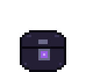

# Chestnut

<p align="center">
  <a href="https://gapmiss.github.io/chestnut"></a>
</p>

A native macOS desktop companion for Obsidian users.
[gapmiss.github.io/chestnut](https://gapmiss.github.io/chestnut)

Chestnut is an always-on-top pixel-art treasure-chest creature that reacts to
your writing activity and acts as a control surface across all your vaults. It
watches the filesystem directly, no Obsidian plugin required, no settings
modified.

Native Swift and SpriteKit: ~1 MB download, under 2 MB installed, ~2% idle
CPU. No Electron, no bundled browser, no network calls.

## Features

- **Vault Hopper** lists all your registered vaults. ⏎ opens, ⌘⏎ goes to
  today's daily note, ⌥⏎ reveals in Finder.
- **Pin a vault** so it always sorts first in every list and starts
  pre-selected for captures and deliveries. Toggle with the pin icon or ⌘P.
- **Note Courier** lets you drag files onto the pet and pick a destination
  vault. Notes land at the vault root with their embedded attachments
  (`![[…]]`, ``) resolved and carried along, references rewritten to
  match the destination layout. Other file types go to the attachment folder.
  Conflict-safe naming, journaled for undo.
- **Quick Capture** is a floating panel for jotting markdown into any vault.
  Formatting toolbar, ⌘B/⌘I/⌘K shortcuts, ⌘1-⌘9 to pick the vault. Drafts
  survive dismiss/reopen.
- **Plugins** let you extend drag-and-drop and a paste hotkey with shell
  scripts. See the [User Guide](https://gapmiss.github.io/chestnut/guide.html#plugins)
  for the full reference, [PLUGINS.md](PLUGINS.md) for architecture details,
  and [`Examples/plugins/`](Examples/plugins/) for ready-made examples.
- After a capture or delivery, a speech bubble tells you where your text
  went. Click it to open the note in Obsidian (uses the `obsidian` CLI when
  available, falls back to opening the vault).
- Idle, peek, writing, chomp, carry, deliver, sleep animations. Hand-coded
  pixel-art frames with swappable color themes.

## Install

### Homebrew

```bash
brew install --cask --no-quarantine gapmiss/tap/chestnut
```

### Manual

Download [`Chestnut.dmg`](https://github.com/gapmiss/chestnut/releases/latest/download/Chestnut.dmg) from the [latest release](https://github.com/gapmiss/chestnut/releases/latest), open it, and drag
Chestnut.app into Applications.

Chestnut is ad-hoc signed (not notarized), so macOS will block the first
launch. To allow it:

- Right-click the app, then Open, then click Open in the dialog, or
- Remove the quarantine flag:

```bash
xattr -dr com.apple.quarantine /Applications/Chestnut.app
```

`brew upgrade` does not carry `--no-quarantine` forward, so a blocked launch
can come back after upgrading. Run the `xattr` command above, or upgrade by
reinstalling:

```bash
brew reinstall --cask --no-quarantine gapmiss/tap/chestnut
```

To start automatically, right-click the pet and toggle Launch at Login.

## Requirements

- macOS 14+
- Swift 6 toolchain (Xcode or Command Line Tools), only needed to build from source
- No Xcode project; builds with SPM + Make

## Build & Run

```bash
make build          # swift build (CONFIG=debug|release)
make bundle         # build → .build/Chestnut.app (ad-hoc codesign)
make run            # bundle + open the app
make dmg            # release build → .build/Chestnut.dmg
make check          # runtime checks (no XCTest dependency)
make clean
```

Quit with right-click → Quit, or `pkill -x Chestnut`.

## Architecture

Single Swift executable bundled into a `.app` by the Makefile.

| Layer | Technology | Role |
|-------|------------|------|
| Windows | AppKit | Borderless, transparent, always-on-top pet window |
| Pet rendering | SpriteKit | Sprite animation from hand-coded frame matrices |
| Panels | SwiftUI | Vault palette, capture panel |

```
Sources/Chestnut/
  main.swift, AppDelegate.swift
  Pet/        # PetWindow, PetScene, Sprites, PetController
  Vaults/     # VaultRegistry, VaultWatcher
  Actions/    # ObsidianBridge, Courier, Capture
  Panels/     # SwiftUI palettes/panels (NSPanel-hosted)
  Plugins/    # PluginManifest, PluginRegistry, PluginRunner, PluginDispatch, PluginPalette
  Support/    # Config, Hotkeys, Journal
```

## Configuration

Two files in `~/Library/Application Support/Chestnut/`:

- **`config.json`** is yours: hotkeys, capture destination, notice duration,
  custom sprite themes. Chestnut never writes to it, apart from creating it on
  first run. Hand-editable; changes take effect on next launch.
- **`state.json`** is Chestnut's: window position, size, opacity, theme, pinned
  vault, disabled plugins. Everything in it has a control in the right-click
  menu.

Keeping them apart means editing `config.json` while Chestnut is running is
safe. Upgrading from 0.2.x splits the old single file automatically and keeps
the original as `config.json.pre-0.3`. See the
[User Guide](https://gapmiss.github.io/chestnut/guide.html#configuration)
for the full reference.

## Design Principles

- Read-only. Never modifies Obsidian's files or `.obsidian/` settings.
- Vaults keyed by path, not name (names collide).
- No network calls, no telemetry.
- The `obsidian` CLI is optional. Every CLI call has a filesystem fallback.
- No image assets. Sprites are string matrices mapped through a palette.

## Contributing

See [CONTRIBUTING.md](CONTRIBUTING.md) for build instructions and ground
rules.

## License

[MIT](LICENSE) © [@gapmiss](https://github.com/gapmiss)
